# Практическая работа №3 WAZUH
## Выполнил студент группы ББМО-01-23 Морин А.А.

### Развернуть 2 ВМ и обеспечить между ними сетевой обмен
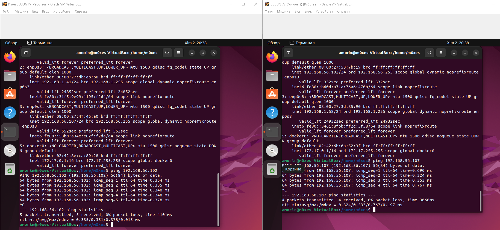

### Развернуть на одной из ВМ сервер WAZUH, а на другой клиент

Установка Wazuh-indexer

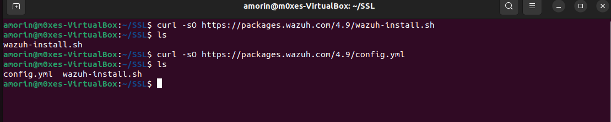

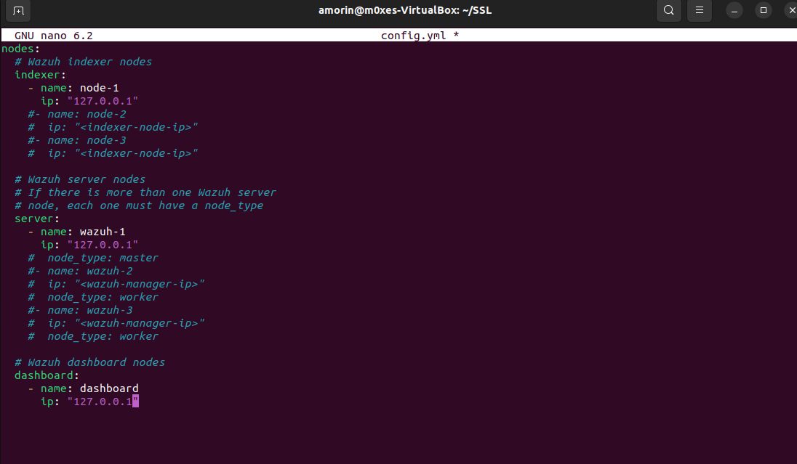

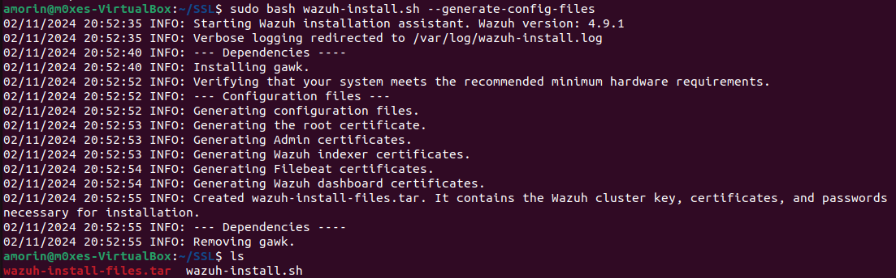

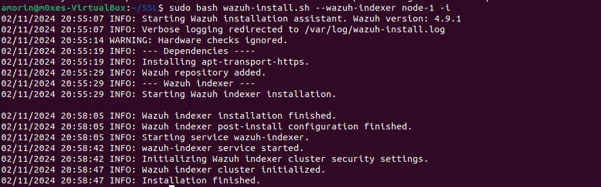

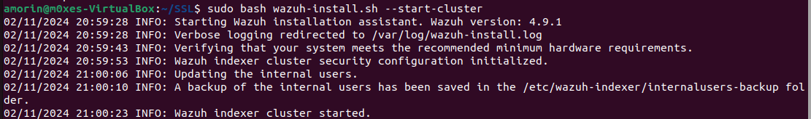

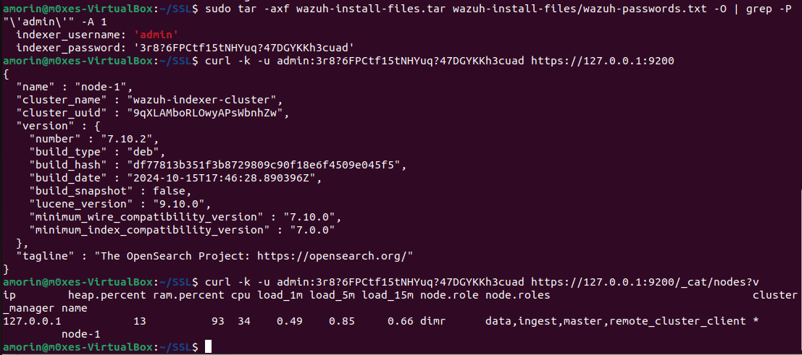

Установка Wazuh-server

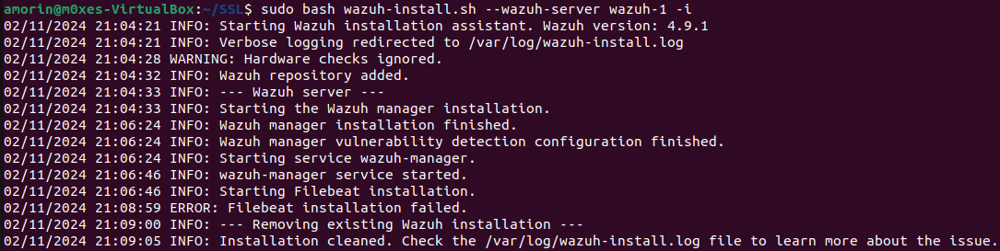

Установка Wazuh-dashboard

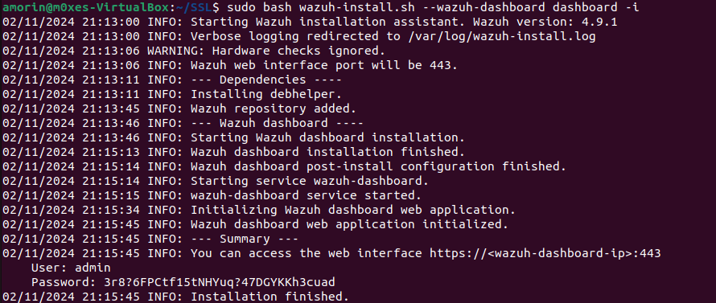

*из-за проблем с виртуалками переустанавливал всё на новые, теперь две виртуалки с адресами в 192.168.х.х диапазоне

Установка Wazuh-agent на клиенте

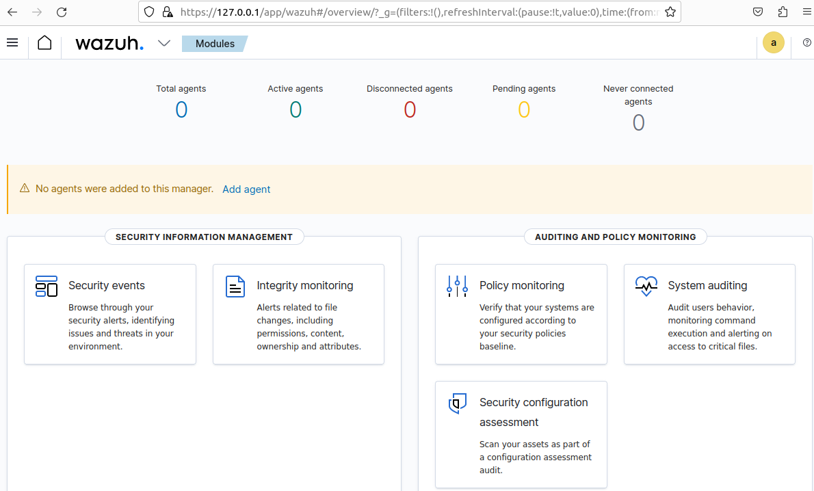

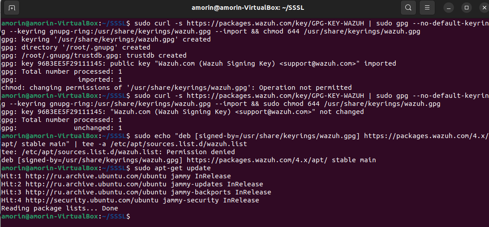

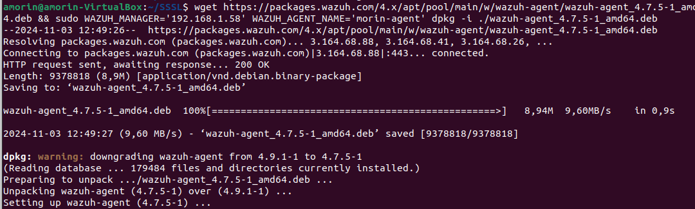

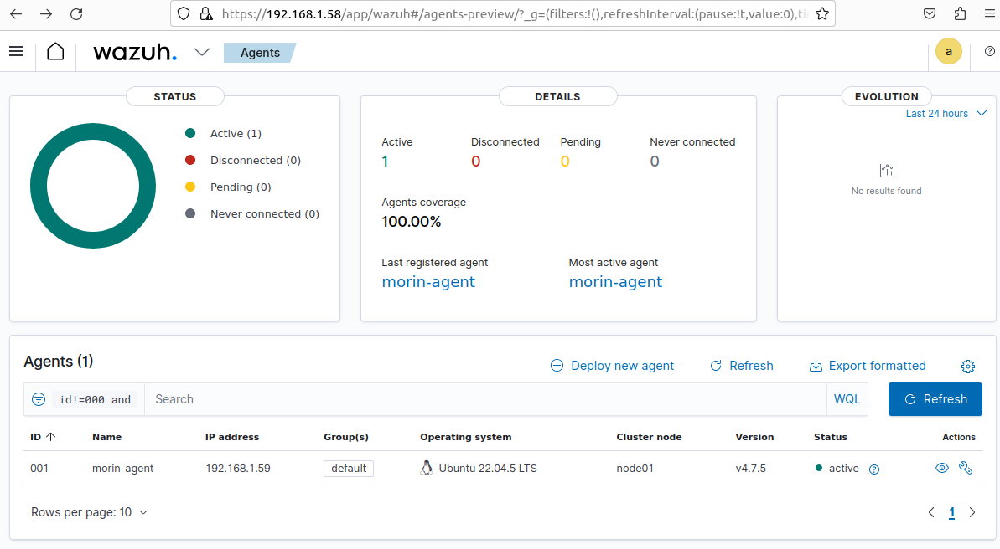

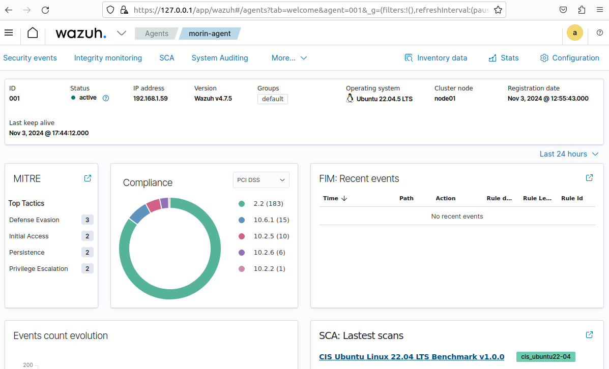

### Сканирование на уязвимости

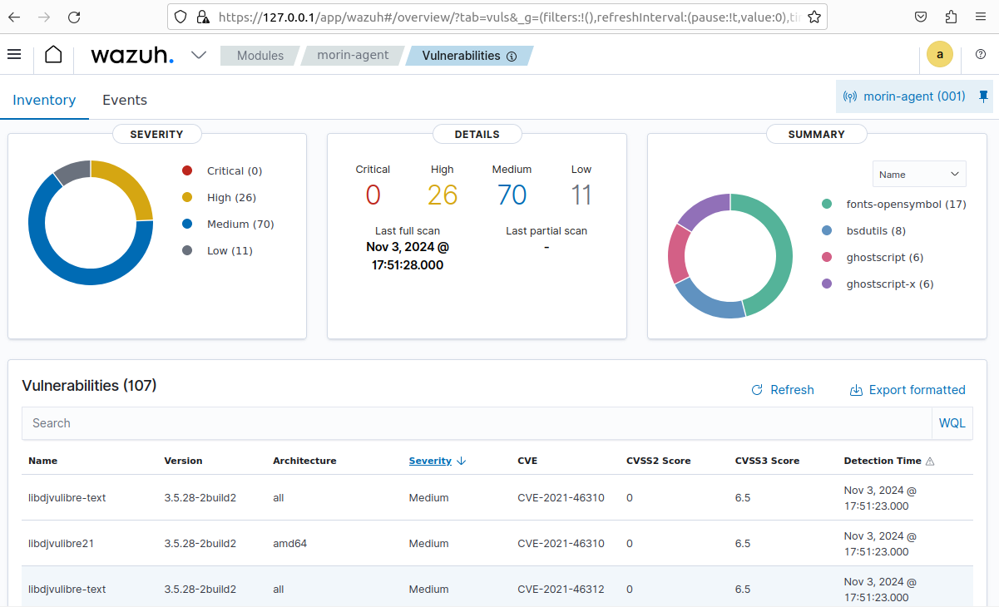

### Создание проверки целостности файлов

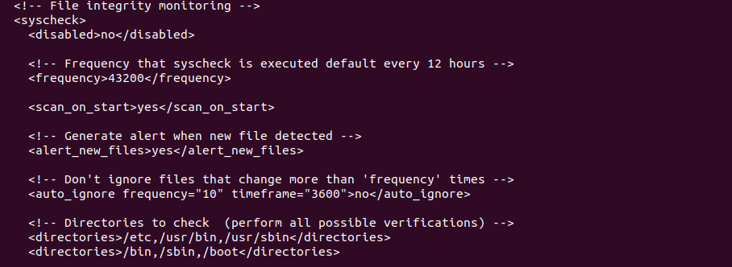

### Настройка выявлений уязвимостей в соответсвии с документацией

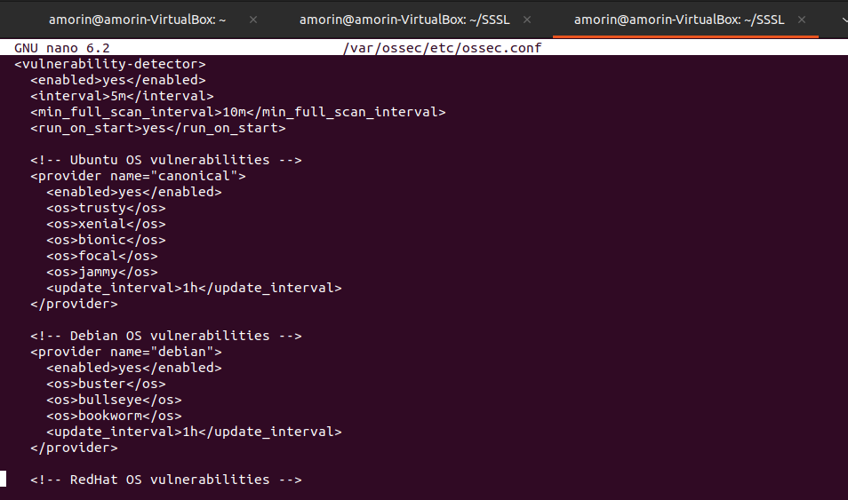

### Выявление скрытых процессов

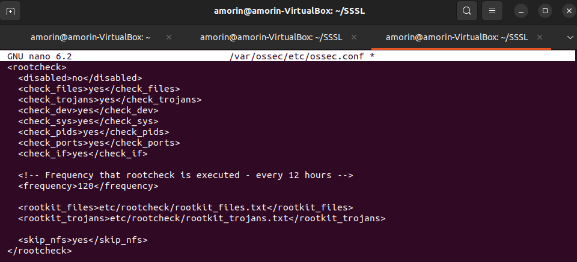

### Выявление SQL-инъекций

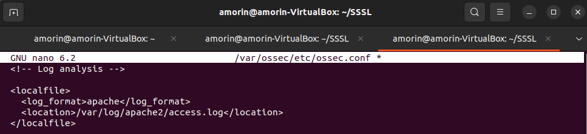

### Проверка работы настроенных механизмов

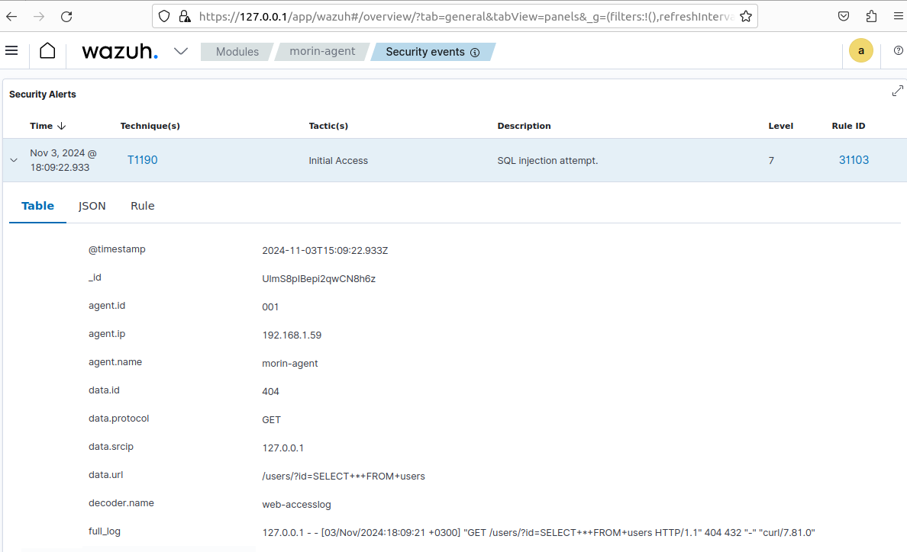
