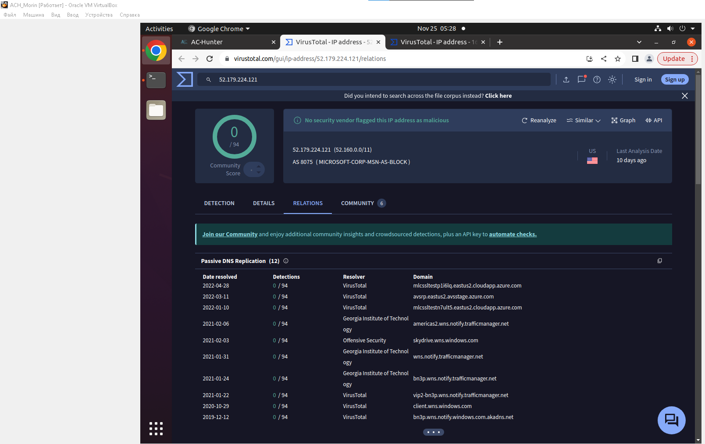

# Практическая работа №4
## Выполнил студент группы ББМО-01-23 Морин А.А.

### Развернуть стенд

### Импорт логов

### Первая лаба

- Крайне высокий показатель beacon score.
- За последние 24 часа было сделано 3 011 подключений.
- Отсутствует строка хостинга.

Остальные адреса являются легитимными, поскольку связаны с доменами microsoft и windows

Выводы:
- Первая запись выглядит подозрительно
- Остальные выглядят легитимными, внесём последние 5 записей в safelist

Итоговый safelist

Просмотр первого адреса

Рассмотрим длительные подключения

Первый адрес

Второй адрес

Он вполне легитимный

Выводы:

Соединение с 104.248.234.238 явно не является нормальным, поскольку
- Нет FQDN
- Большое количество соединений с атрибутами Beacon strong
- Изменена строка агента
- Нет хоста в HTTP-заголовке
- URI длинный и запутанный

### Вторая лаба

Импорт логов

Переходим во вкладку DNS, поскольку только в ней что-то есть

Меняем фильтры

Выводы:
- Нет IP-адресов, только DNS
- Имя хоста из 16ричных символов
- Скорее всего это C2 через DNS 

### Третья лаба

Импорт логов

Смотрим внимательнее

- Подозрительное доменное имя skypetm
- Очень высокий показатель beacon score.
- За последние 24 часа было сделано 3 188 подключений

Аналогичная ситуация с длительными подключениями

