# Практическая работа №5 - Threat Hunting

**Выполнил студент группы ББМО-01-23 Морин А.А.**

Для выполнения работы используем стенд из практической работы 3

Стенд состоит из 3 виртуальных машин
1) Ubuntu с агентом Wazuh
2) Ubuntu с сервером Wazuh
3) Kali Linux

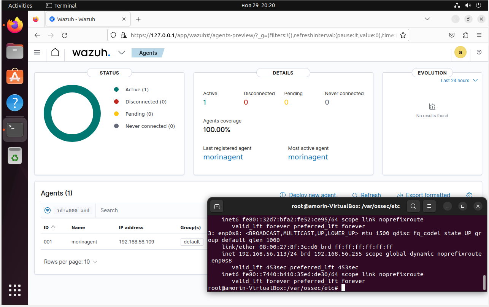

# IDS Suricata

Развернем дополнительно на защищаемом хосте IDS Suricata

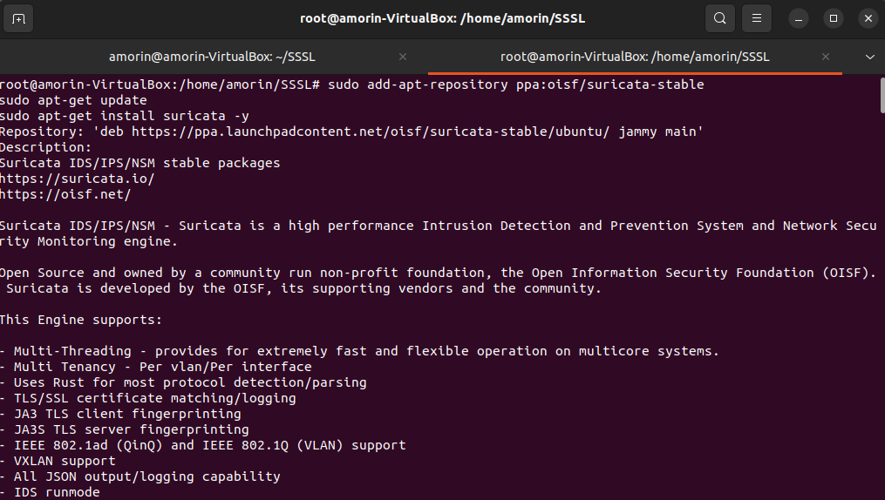

Также качаем правила

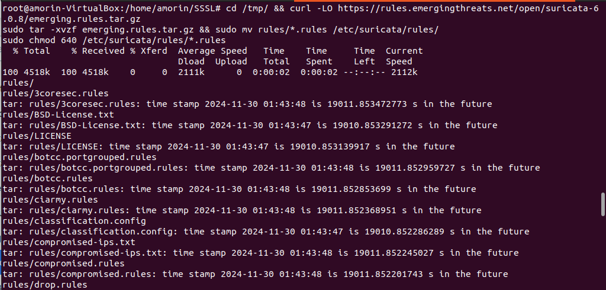

Модифицируем конфиг

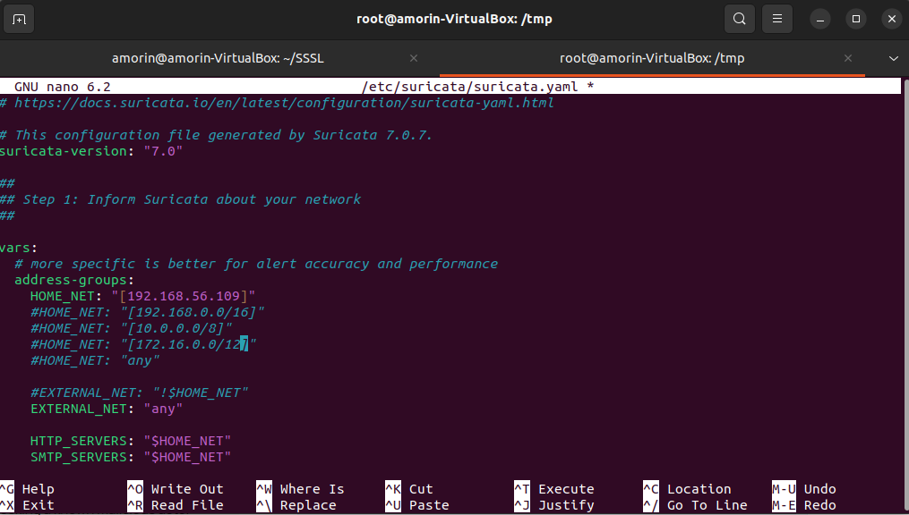

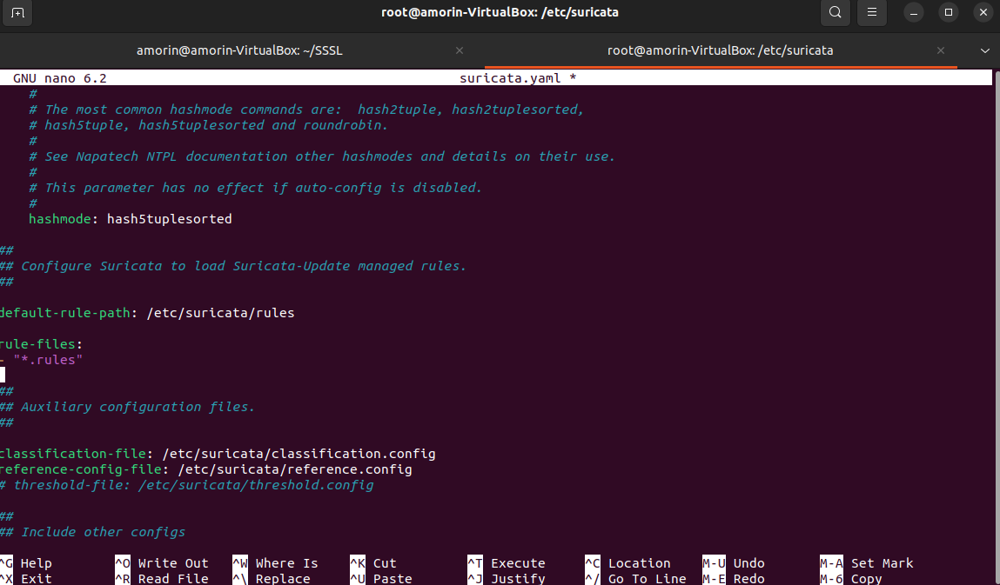

Внесем сбор логов сурикаты в конфиг Wazuh

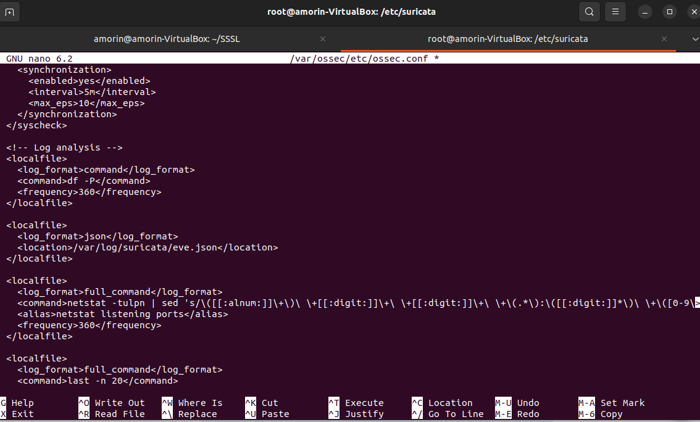

Проверка получения логов сурикаты

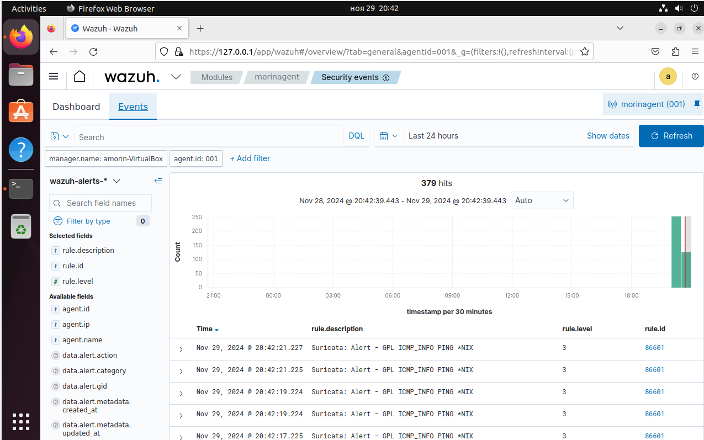

# Web-приложение

На защищаемом клиенте поднята пустая вебка Apache

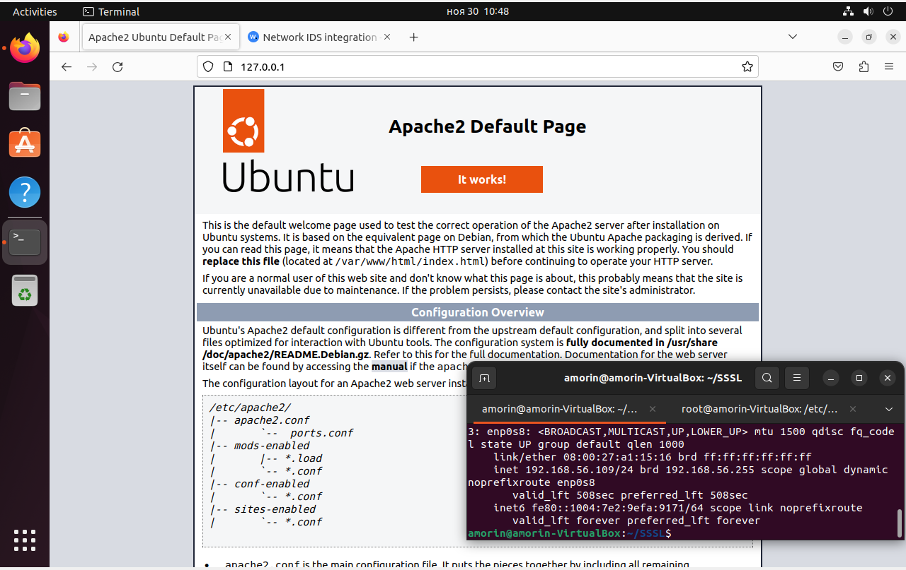

# Сканер уязвимостей Nikto

Запустим сканер Nikto

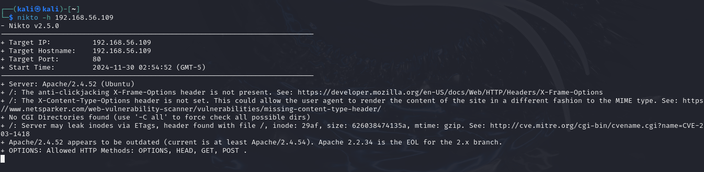

События от сурикаты

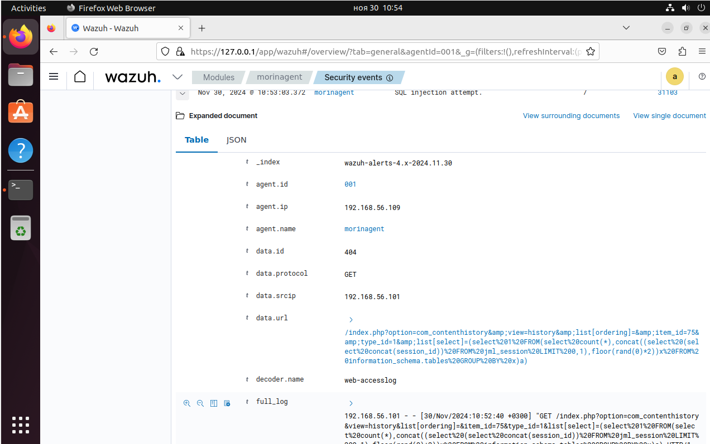

# YARA

Скачивание, компиляция и установка YARA

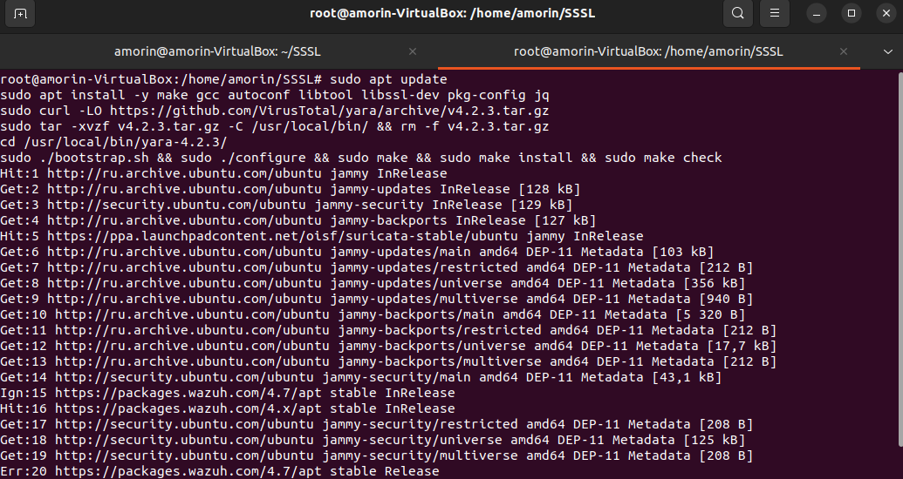

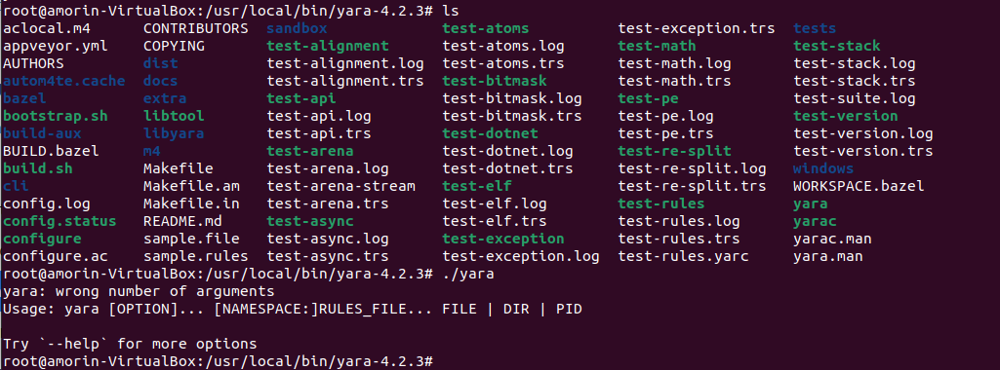

Качаем правила

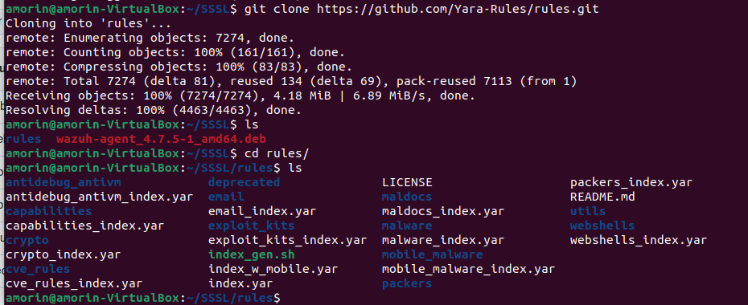

Создаём конфиг

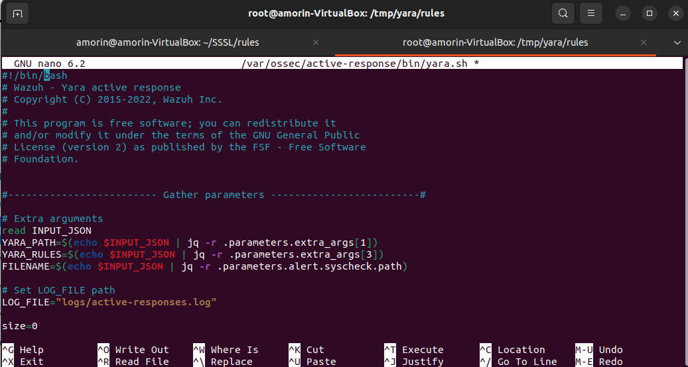

Редактируем ossec конфиг

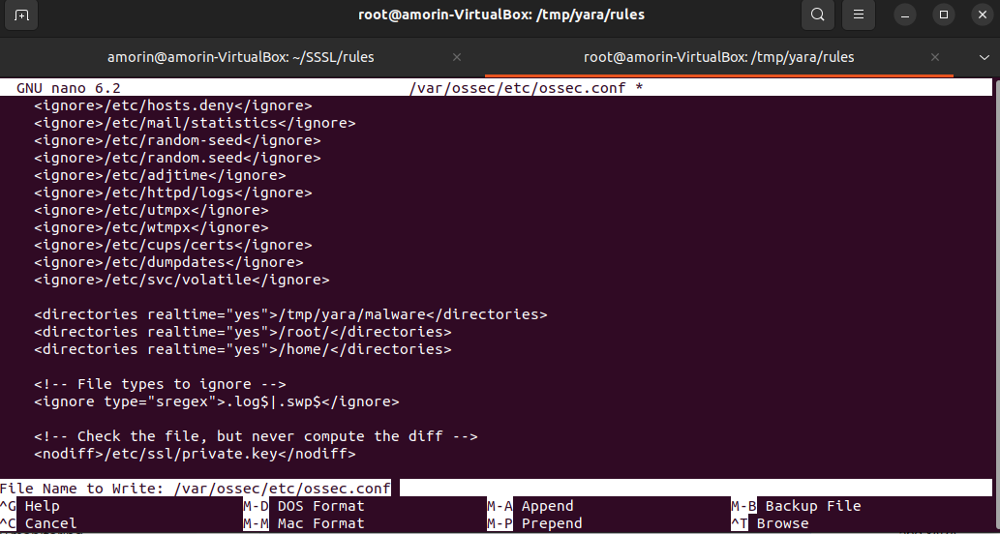

На сервере

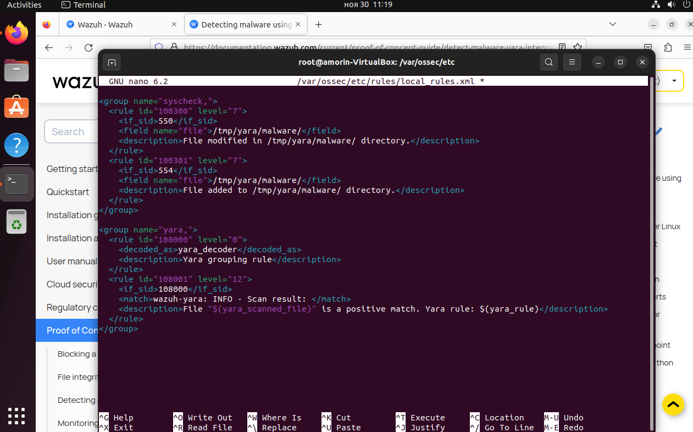

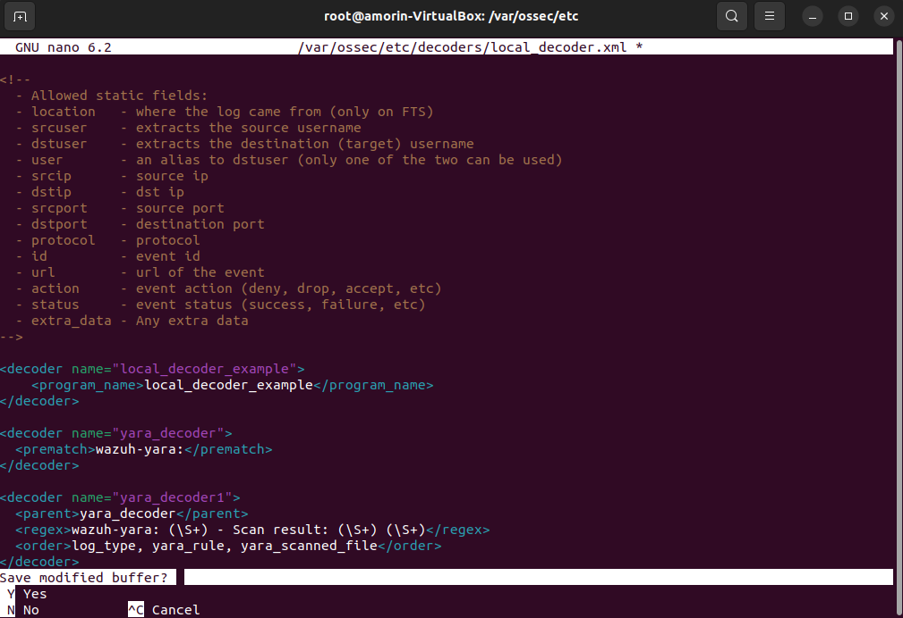

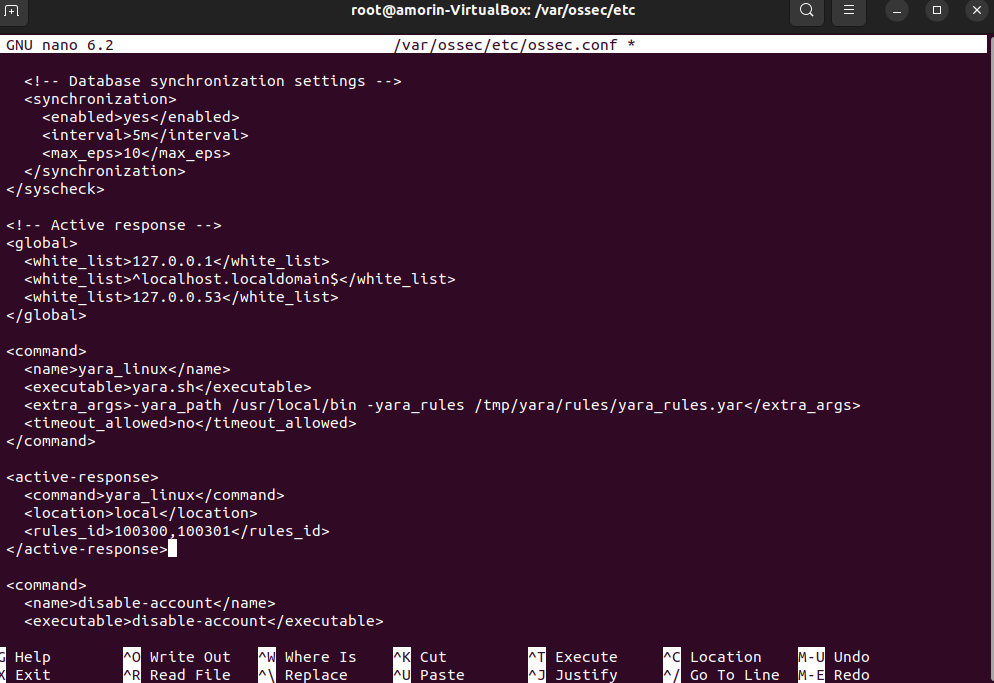

Срабатывание правил

